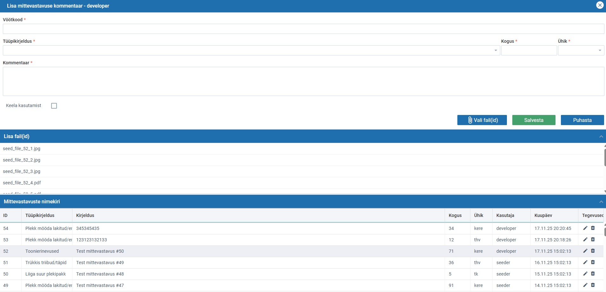

# MetaPrint – Mittevastavuste halduse veebirakendus

See projekt on lihtne veebipõhine rakendus mittevastavuste (nonconformities) sisestamiseks, haldamiseks ja failidega sidumiseks.  
Tagapoolne osa on tehtud Laraveliga (PHP 8), esipool Webix JS teegiga.  
Projekt on konteineriseeritud Dockeriga, kuid töötab soovi korral ka ilma selleta.

---

## Tehnoloogiad

**Backend:**
- PHP 8.x
- Laravel 10
- MySQL 5.7+

**Frontend:**
- Webix (laetud CDN kaudu)
- Puhtas JavaScript + komponendipõhine struktuur

**Docker:**
- Backend (Laravel)
- Frontend (Nginx + staatilised failid)
- MySql

---

## Käivitamine Dockeriga

Eeldused: Docker + Docker Compose.

1. Kloneeri projekt
   ```bash
   git clone https://github.com/ajakupson/Webix-Laravel-MySql-Docker.git
   ```
   ```
   cd Webix-Laravel-MySql-Docker
2. Sea backend keskkond
   ```
   cp backend/.env.example backend/.env
3. Käivita
   ```
   composer install
   docker compose build
4. Loo andmebaasi tabelid
   ```
   docker compose exec backend php artisan migrate
   docker compose exec backend php artisan storage:link
5. Ava rakendus
   ```
   docker compose up
   Frontend: http://localhost:8080
   API: http://localhost:8000/api/nonconformity
### Demoandmete lisamine (seederid)

Projekt sisaldab kahte seederit:

- **NonconformitySeeder** – loob 50 testkirjet
- **NonconformityFileSeeder** – lisab igale kirjele 10 faili (kokku 500 faili viidet)

Seederid käivitatakse käsuga:
```
docker compose exec backend php artisan db:seed
```

## Käivitamine ilma Dockerita

### Backend

1. Mine backend kataloogi
   ```
   cd backend
2. Paigalda sõltuvused
   ```
   composer install
3. Loo .env ja seadista MySQL ühendus
   ```
   cp .env.example .env
   
   APP_URL=http://localhost:8000

   DB_CONNECTION=mysql
   DB_HOST=127.0.0.1
   DB_PORT=3306
   DB_DATABASE=your_database
   DB_USERNAME=your_user
   DB_PASSWORD=your_pass
   
   php artisan key:generate
   ```
4. Loo tabelid ja storage link
   ```
   php artisan migrate
   php artisan storage:link
5. Käivita Laravel dev-server
   ```
   php artisan serve --host=0.0.0.0 --port=8000
6. Seederid on ühendatud DatabaseSeeder kaudu ning käivitatakse automaatselt
   ```
   php artisan db:seed
### Frontend

Frontend on staatiline, vajab ainult lihtsat serverit.
   ```
   cd frontend/app
   php -S localhost:8081
   Ava: http://localhost:8081/app/index.html
   ```
   
## SQL skeem (kui soovitakse luua tabelid käsitsi)
   ```
CREATE TABLE `nonconformities` (
  `id` BIGINT UNSIGNED NOT NULL AUTO_INCREMENT,
  `barcode` VARCHAR(255) NOT NULL,
  `type_code` VARCHAR(255) NOT NULL,
  `quantity` INT UNSIGNED NOT NULL,
  `unit` VARCHAR(10) NOT NULL,
  `comment` VARCHAR(500) DEFAULT NULL,
  `created_by` VARCHAR(255) NOT NULL,
  `disabled` TINYINT(1) NOT NULL DEFAULT 0,
  `created_at` TIMESTAMP NULL DEFAULT NULL,
  `updated_at` TIMESTAMP NULL DEFAULT NULL,
  PRIMARY KEY (`id`),
  KEY `nonconformities_type_code_index` (`type_code`),
  KEY `nonconformities_unit_index` (`unit`)
) ENGINE=InnoDB DEFAULT CHARSET=utf8mb4 COLLATE=utf8mb4_unicode_ci;
   ```

   ```
CREATE TABLE `nonconformity_files` (
  `id` BIGINT UNSIGNED NOT NULL AUTO_INCREMENT,
  `nonconformity_id` BIGINT UNSIGNED NOT NULL,
  `path` VARCHAR(255) NOT NULL,
  `original_name` VARCHAR(255) NOT NULL,
  `mime_type` VARCHAR(100) DEFAULT NULL,
  `size` BIGINT UNSIGNED DEFAULT NULL,
  `created_at` TIMESTAMP NULL DEFAULT NULL,
  `updated_at` TIMESTAMP NULL DEFAULT NULL,
  PRIMARY KEY (`id`),
  KEY `nonconformity_files_nonconformity_id_index` (`nonconformity_id`),
  CONSTRAINT `nonconformity_files_nonconformity_id_foreign`
    FOREIGN KEY (`nonconformity_id`)
    REFERENCES `nonconformities` (`id`)
    ON DELETE CASCADE
) ENGINE=InnoDB DEFAULT CHARSET=utf8mb4 COLLATE=utf8mb4_unicode_ci;
   ```

## Projekti struktuur
   ```
MetaPrint/
├─ docker-compose.yml
├─ README.md
│
├─ backend/ - Laravel API
│  ├─ Dockerfile
│  ├─ .env
│  ├─ app/
│  │  ├── Enums/
│  │  │   ├── NonconformityUnit.php
│  │  │   └── NonconformityType.php
│  │  ├─ Http/
│  │  │  └─ Controllers/
│  │  │     └─ Api/
│  │  │        ├─ NonconformityController.php
│  │  │        └─ NonconformityFileController.php
│  │  └─ Models/
│  │     ├─ Nonconformity.php
│  │     └─ NonconformityFile.php
│  │
│  ├─ database/
│  │  ├─ migrations/
│  │  │  ├─ create_nonconformities_table.php
│  │  │  └─ create_nonconformity_files_table.php
│  │  └─ seeders/
│  │     └─ DatabaseSeeder.php
│  │     └─ NonconformityFileSeeder.php
│  │     └─ NonconformitySeeder.php
│  │
│  └─ routes/
│     └─ api.php
│
└─ frontend/
   ├─ Dockerfile
   └─ app/
      ├─ index.html
      ├─ styles.css
      ├─ main.js
      ├─ api.js
      ├─ helpers.js
      ├─ constants.js 
      │
      └─ components/
         ├─ nonconformityForm.js
         ├─ attachmentPanel.js
         └─ nonconformityTable.js
   ```

## API (REST-laadne, JSON)

Rakenduse backend pakub lihtsat JSON-põhist REST-stiilis API-d.

- **GET /api/nonconformity** – tagastab kõik kirjed koos seotud failidega
- **GET /api/nonconformity/{id}** – tagastab ühe konkreetse kirje + failid
- **POST /api/nonconformity** – loob uue mittevastavuse (sisend ja väljund JSON)
- **PUT /api/nonconformity/{id}** – uuendab olemasolevat kirjet
- **DELETE /api/nonconformity/{id}** – kustutab kirje (koos failidega)
- **POST /api/nonconformity/{id}/files** – lisab failid konkreetsele mittevastavusele  
  (multipart upload, server salvestab failid `storage/app/public/nonconformity_files`)

## UI



## Märkused

1. Frontend kasutab Webix UI komponente otse CDN-ist.
2. Failide üleslaadimine toimub multipart-formina, server salvestab need storage/app/public/nonconformity_files alla ning teeb need avalikuks Laravel storage link’i kaudu.
3. API päringud tagastavad ja võtavad vastu JSON-i, välja arvatud failide lisamisel.
4. Andmete laadimisel kuvatakse modaalaknas progressi-indikaator.


